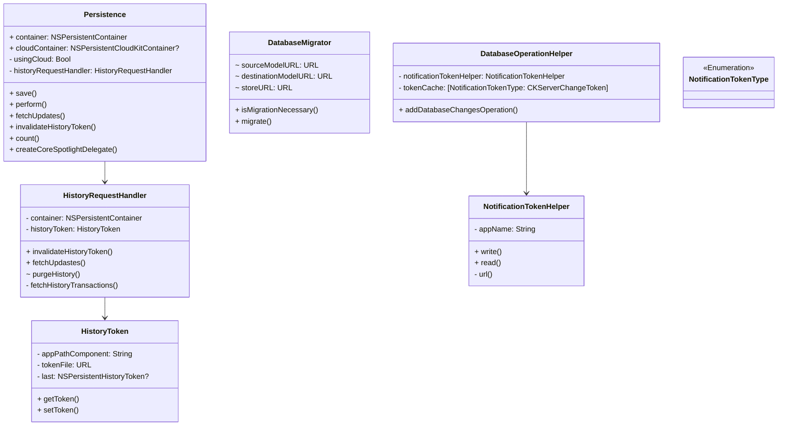

```mermaid
classDiagram

Persistence --> HistoryRequestHandler

class Persistence {
    + container: NSPersistentContainer
    + cloudContainer: NSPersistentCloudKitContainer?
    - usingCloud: Bool
    - historyRequestHandler: HistoryRequestHandler
    + save()
    + perform()
    + fetchUpdates()
    + invalidateHistoryToken()
    + count()
    + createCoreSpotlightDelegate()
} 

HistoryRequestHandler --> HistoryToken

class HistoryRequestHandler {
    - container: NSPersistentContainer
    - historyToken: HistoryToken
    + invalidateHistoryToken()
    + fetchUpdastes()
    ~ purgeHistory()
    - fetchHistoryTransactions()
}

class HistoryToken {
    - appPathComponent: String
    - tokenFile: URL
    - last: NSPersistentHistoryToken?
    + getToken()
    + setToken()
}

class DatabaseMigrator {
    ~ sourceModelURL: URL
    ~ destinationModelURL: URL
    ~ storeURL: URL
    + isMigrationNecessary()
    + migrate()
}

DatabaseOperationHelper --> NotificationTokenHelper

class DatabaseOperationHelper {
    - notificationTokenHelper: NotificationTokenHelper
    - tokenCache: [NotificationTokenType: CKServerChangeToken]
    + addDatabaseChangesOperation()
}

class NotificationTokenHelper {
    - appName: String
    + write()
    + read()
    - url()
}

class NotificationTokenType {
    <<Enumeration>> 
}


```