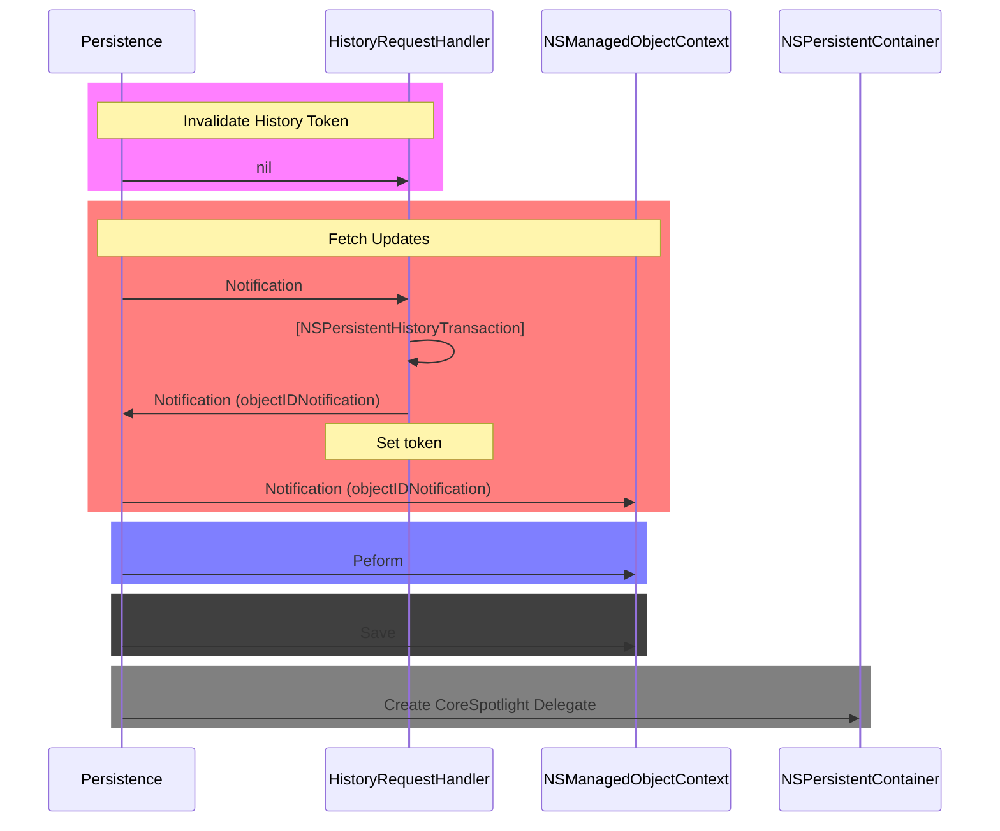
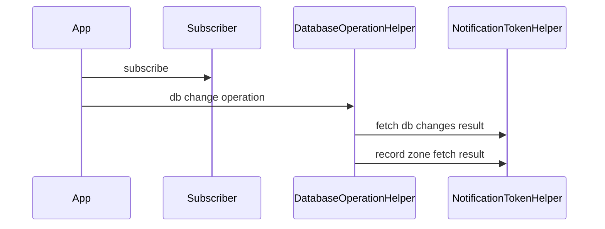
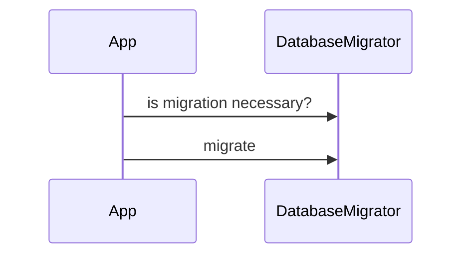

```mermaid
sequenceDiagram

rect rgba(255, 0, 255, 0.5)
note over Persistence, HistoryRequestHandler: Invalidate History Token
Persistence ->> HistoryRequestHandler : nil
end

rect rgba(255, 0, 0, 0.5)
note over Persistence, NSManagedObjectContext: Fetch Updates
Persistence ->> HistoryRequestHandler : Notification
HistoryRequestHandler ->> HistoryRequestHandler: [NSPersistentHistoryTransaction]
HistoryRequestHandler ->> Persistence : Notification (objectIDNotification)
note over HistoryRequestHandler: Set token
Persistence ->> NSManagedObjectContext : Notification (objectIDNotification)
end

rect rgba(0, 0, 255, 0.5)
Persistence ->> NSManagedObjectContext : Peform
end

rect rgb(64, 64, 64)
Persistence ->> NSManagedObjectContext : Save
end

rect rgb(128, 128, 128)
Persistence ->> NSPersistentContainer : Create CoreSpotlight Delegate
end

```

```mermaid
sequenceDiagram

App ->> Subscriber : subscribe

App ->> DatabaseOperationHelper: db change operation

DatabaseOperationHelper ->> NotificationTokenHelper : fetch db changes result

DatabaseOperationHelper ->> NotificationTokenHelper : record zone fetch result

```

```mermaid
sequenceDiagram

App ->> DatabaseMigrator: is migration necessary?

App ->> DatabaseMigrator: migrate

```
